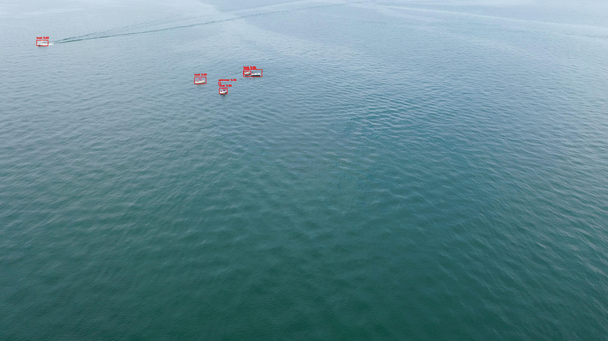

# Multi-Model Maritime Tracking Pipeline
Unified Multi-Stage Object Detection, Transformer Classification, and Telemetry-Augmented Recurrent Tracking for Search and Rescue

<div align="center">
  
</div>
<br>

This repository contains the implementation and evaluation suite for a multi-stage, cascaded computer vision pipeline designed for Multi-Object Tracking (MOT) in maritime Search and Rescue (SAR) scenarios. 

Developed using the SeaDroneSee benchmark dataset, the system is engineered to address critical challenges such as intense unmanned aerial vehicle (UAV) ego-motion, extreme variations in target scales, and dynamic aquatic backgrounds. The architecture fuses deep spatial feature extraction, visual transformer verification, and recurrent trajectory prediction augmented with 12-dimensional flight telemetry vectors.

---

## MaCVi / SeaDroneSee Framework Application

This implementation utilizes the official SeaDroneSee Multi-Object Tracking specifications. The pipeline is structured into two distinct, standalone architectures tailored for high-precision server-side processing and low-latency edge deployment:

### 1. High-Precision Heavy Pipeline
- **Object Detector**: YOLOv10x for robust spatial localization.
- **Visual Classifier**: Swin-B Transformer for false-positive verification on low-certainty detections.
- **Sequence Tracker**: Rich-Telemetry LSTM incorporating 12-D drone metadata.

### 2. Edge-Optimized Light Pipeline
- **Object Detector**: YOLOv10n (Nano) for high-throughput processing.
- **Visual Classifier**: MobileViT for efficient verification.
- **Sequence Tracker**: Telemetry-Augmented Gated Recurrent Unit (GRU).

---

## System Components and Technical Pipeline

The inference logic executes a cascaded flow from raw UAV frames to fully associated, motion-smoothed target tracks.

### Slicing Aided Hyper Inference (SAHI)
To mitigate high-altitude invisibility of small targets (e.g., swimmers and lifejackets), the input is processed using overlapping visual slices. Detections are dynamically merged via Non-Maximum Suppression (NMS) to restore the global coordinates.

### Dual-Stage Confidence Cascade
Detections are processed through a hierarchical confidence gate:
- **High-Confidence Cases**: Routed directly to the track association engine.
- **Marginal-Confidence Cases**: Routed to the vision transformer classifier (Swin-B/MobileViT) for secondary validation, eliminating confusion between whitecaps/ocean foam and rescue targets.

### Telemetry-Augmented Recurrent State Update
To compensate for camera gimbal rotations and UAV maneuvers, our LSTM and GRU trackers predict displacement vectors based on a 12-Dimensional temporal vector:
- **Relative Target States**: $[dx, dy, width, height]$
- **Global UAV Flight States**: $[gps\_lat, gps\_lon, altitude, pitch, heading, xspeed, yspeed, zspeed]$

---

## Benchmark Comparison Matrix

| Pipeline Attribute | Heavy Implementation | Light Implementation |
| :--- | :--- | :--- |
| **Deployment Target** | GPU/High-Precision Operations | Jetson Nano / UAV Edge Compute |
| **Spatial Localization** | YOLOv10x | YOLOv10n |
| **Visual Verification** | Swin-B Transformer | MobileViT |
| **Recurrent Engine** | Rich-Telemetry LSTM | Telemetry-Augmented GRU |
| **Ego-Motion Corrections** | Enabled (12-D Vector) | Enabled (12-D Vector) |
| **Inference Architecture** | Full / Cascaded Sparse Support | Full / Cascaded Sparse Support |

---

## Performance Evaluation Dashboards

Quantitative metrics are generated via the integrated Matplotlib evaluation dashboards. Evaluated datasets focus on multi-object tracking sequences on open water.

### Key Evaluation Metrics:
- **Mean Intersection over Union (IoU)**
- **mAP @ IoU 0.50 and mAP @ IoU 0.75**
- **Mean Absolute Error (MAE) in Centroid Pixels**
- **Root Mean Square Error (RMSE) of Euclidean Center Offsets**

Evaluation notebooks (`Evaluate_LSTM.ipynb` and `GRU_evaluate.ipynb`) enforce explicit coordinate-limit scaling to visualize sub-pixel accuracy without axis-scaling distortions.

---

## Repository Directory Layout

```text
Deep-Learning-Project/
├── heavy_model/             # High-Accuracy Heavy Inference Suite
│   ├── classifier/          # Swin-B Transformer weights and exports
│   ├── data/                # Sequence training split (.npy datasets)
│   ├── detector/            # YOLOv10x base weight checkpoints
│   ├── tracker/             # Evaluate_LSTM.ipynb and SORT tracking engine
│   ├── demo.py              # Unified heavy execution framework
│   └── inference.py         # Minimal batch frame processing utility
├── light_model/             # Edge-Optimized Lightweight Suite
│   ├── classifier/          # MobileViT classifier weights and exports
│   ├── data/                # Sequence training split (.npy datasets)
│   ├── detector/            # YOLOv10n base weight checkpoints
│   ├── tracker/             # GRU_evaluate.ipynb and SORT tracking engine
│   ├── demo.py              # Unified light execution framework
│   └── inference.py         # Minimal batch frame processing utility
├── .gitignore               # Automated exclusion of large model binaries
└── README.md                # Technical Documentation
```

---

## Usage Guide and Execution Interfaces

### Unified Pipeline Execution
The primary execution engine supports baseline execution (inference on all frames) and computational sparse modes. 

#### Sparse Execution (Default)
Inference is generated every 3rd frame, with the recurrent tracking engines handling intermediate sequence interpolation to reduce computational burden:
```bash
python demo.py "data/DJI_0063_images.tar.gz"
```

#### Baseline Execution
Executes complete spatial and classification inference cascades on every continuous frame:
```bash
python demo.py "data/DJI_0063_images.tar.gz" --skip-n 1
```

### Configuration Tuning
Core runtime parameters can be configured in the global header section of `demo.py`:
```python
DETECTION_CONF   = 0.30   # Object localization threshold
USE_SAHI         = True   # Sliced Aided Hyper Inference toggle
USE_CLASSIFIER    = True   # Cascade verification state
CLASSIFIER_THRESH = 0.70   # Secondary classifier confidence floor
```

---

## Citation

If you find the SeaDroneSee datasets or tracking architectures used in this project helpful for research, please cite the primary dataset citation:

```bibtex
@inproceedings{varga2022seadronessee,
title={Seadronessee: A maritime benchmark for detecting humans in open water},
author={Varga, Leon Amadeus and Kiefer, Benjamin and Messmer, Martin and Zell, Andreas},
booktitle={Proceedings of the IEEE/CVF Winter Conference on Applications of Computer Vision},
pages={2260--2270},
year={2022}
}
```

---

## Credits

This research project was conducted and integrated by:

- [**Yousef Medhat**](https://www.linkedin.com/in/yousef-medhat-7293232a1/)
- [**Yousef Waheed**](https://www.linkedin.com/in/youssef-waheed-8462061a7/)
- [**Ali Abdou**](https://www.linkedin.com/in/ali-abdouu/)
- [**Amira Azzam**](https://www.linkedin.com/in/amira-azzam2510/)
- [**Maria Gerges**](https://www.linkedin.com/in/maria-gerges-81b04a30a/)
- [**Dina Mohamed**](https://www.linkedin.com/in/dina-mohamed-96617b2a5/)

---

## License
Code assets are maintained under the [MIT License](https://mit-license.org/).
