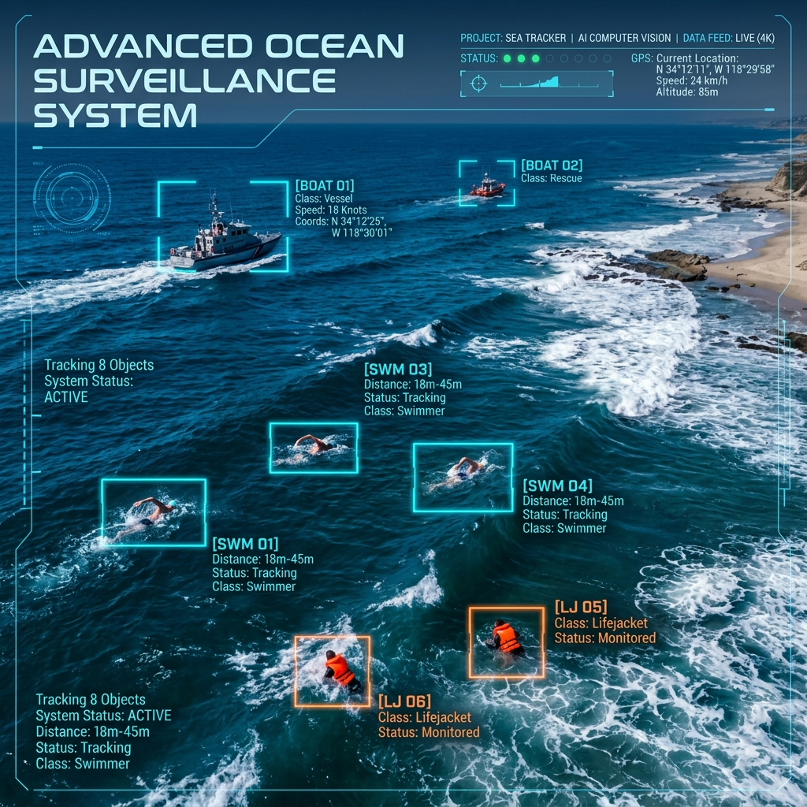

<p align="center">
  
</p>

<h1 align="center">Maritime SAR Tracking Pipeline</h1>

<p align="center">
  <strong>Unified Multi-Stage Object Detection, Transformer Classification &amp; Telemetry-Augmented Recurrent Tracking for Maritime Search and Rescue</strong>
</p>

<p align="center">
  <a href="#heavy-pipeline"></a>
  <a href="#light-pipeline"></a>
  <a href="#license"></a>
  <a href="https://pytorch.org/"></a>
</p>

<br/>

<p align="center">
  
</p>

<br/>

## 📋 Overview

This repository implements a **multi-stage, cascaded computer vision pipeline** for **Multi-Object Tracking (MOT)** in maritime Search and Rescue (SAR) scenarios. Built on the **SeaDroneSee** benchmark dataset, the system is engineered to overcome critical challenges inherent to UAV-based maritime surveillance:

- **Extreme UAV Ego-Motion** — Aggressive camera gimbal rotations and platform maneuvers
- **Scale Variation** — Targets ranging from near-invisible swimmers to large rescue vessels
- **Dynamic Aquatic Backgrounds** — Whitecaps, ocean foam, and sun glare causing persistent false positives

The architecture fuses deep spatial feature extraction, visual transformer verification, and recurrent trajectory prediction augmented with **12-dimensional flight telemetry vectors**.

---

## 🏗️ Architecture

The pipeline is structured into two standalone architectures — one optimized for **high-precision server-side processing** and one for **low-latency edge deployment** — both following the same cascaded inference flow:

```
 UAV Frame Input
       │
       ▼
┌──────────────────────┐
│  SAHI Slice Engine   │  Overlapping 640×640 crops + NMS merge
└──────────┬───────────┘
           ▼
┌──────────────────────┐
│  YOLO Object Detect  │  YOLOv8x (Heavy) │ YOLOv10n (Light)
└──────────┬───────────┘
           ▼
┌──────────────────────┐
│  Confidence Cascade  │  High-conf → Track │ Low-conf → ViT Verify
└──────────┬───────────┘
           ▼
┌──────────────────────┐
│  Transformer Filter  │  Swin-B (Heavy) │ MobileViT (Light)
└──────────┬───────────┘
           ▼
┌──────────────────────┐
│  Hungarian Matching  │  Cost = Normalized Centroid Distance + (1 − IoU)
└──────────┬───────────┘
           ▼
┌──────────────────────┐
│  Recurrent Tracker   │  LSTM (Heavy) │ GRU (Light) + 12-D Telemetry
└──────────┬───────────┘
           ▼
   Tracked Outputs
```

<br/>

<h3 id="heavy-pipeline">⚙️ Heavy Pipeline — High-Precision</h3>

| Component | Model | Details |
|:---|:---|:---|
| **Detector** | YOLOv8x | Fine-tuned on SeaDroneSee with SAHI-augmented training |
| **Classifier** | Swin-B Transformer | `swin_base_patch4_window7_224` · 5-class verification |
| **Tracker** | Rich-Telemetry LSTM | 2-layer stacked LSTM · 128 hidden units · 12-D input |
| **Target** | GPU / Server | High-precision, full cascade |

<h3 id="light-pipeline">🪶 Light Pipeline — Edge-Optimized</h3>

| Component | Model | Details |
|:---|:---|:---|
| **Detector** | YOLOv10n (Nano) | Optimized for throughput on constrained hardware |
| **Classifier** | MobileViT | `mobilevit_s` · lightweight verification |
| **Tracker** | Telemetry-Augmented GRU | 2-layer GRU · 128 hidden units · separate X/Y scalers |
| **Target** | Jetson Nano / UAV Edge | Low-latency, real-time capable |

---

## 🔬 Technical Deep Dive

### Slicing Aided Hyper Inference (SAHI)

To counter the invisibility of small targets at high altitudes (swimmers, lifejackets), each input frame is processed as **overlapping 640×640 visual slices** with 20% overlap. Detections from all slices are dynamically merged via Non-Maximum Suppression (NMS) to restore global coordinates.

### Dual-Stage Confidence Cascade

Detections pass through a hierarchical confidence gate:

| Confidence Level | Routing |
|:---|:---|
| **≥ 0.70** (High) | Routed directly to the Hungarian matching & track association engine |
| **< 0.70** (Marginal) | Forwarded to the vision transformer classifier for secondary validation — eliminates whitecap/foam confusion with rescue targets |

### Telemetry-Augmented Recurrent State Update

Both LSTM and GRU trackers compensate for camera gimbal rotations and UAV maneuvers by predicting displacement vectors from a **12-Dimensional temporal feature vector**:

```
┌─────────────────────────────────────────────────────────────────────┐
│  Relative Target States    │  dx, dy, width, height                │
├────────────────────────────┼────────────────────────────────────────┤
│  Global UAV Flight States  │  gps_lat, gps_lon, altitude, pitch,   │
│                            │  heading, xspeed, yspeed, zspeed      │
└─────────────────────────────────────────────────────────────────────┘
```

### LSTM / GRU Inference Cycle (10-Frame Window)

Each track executes a 5-step prediction sequence every frame:

1. **Data Accumulation** — The track buffer maintains up to **10 absolute frames**: `[x, y, w, h, telemetry...]`
2. **Velocity Encoding** — Adjacent frames are subtracted to produce **9 relative velocity steps**: $V_n = F_{n+1} - F_n$ for spatial dimensions; telemetry features are passed statically
3. **Domain Normalization** — Velocity vectors are standardized using the training-locked `scaler.pkl` (LSTM) or `scaler_X.pkl` / `scaler_Y.pkl` (GRU) without refitting
4. **Neural Projection** — The normalized tensor `(1, 9, 12)` is pushed through the recurrent network under `torch.no_grad()` to suppress memory footprint
5. **Dimensional Recovery** — The 4-D prediction is inverse-transformed back to physical pixel coordinates and added to the last known absolute position

### LSTM Network Layout

```python
RichLSTMTracker(
    lstm = LSTM(input_size=12, hidden_size=128, num_layers=2, batch_first=True)
    fc   = Linear(128, 64) → ReLU() → Linear(64, 4)  # [dx, dy, w, h]
)
```

### GRU Network Layout

```python
GRUTracker(
    gru = GRU(input_size=12, hidden_size=128, num_layers=2, batch_first=True)
    fc  = Linear(128, 4)  # [dx, dy, w, h]
)
```

---

## 📊 Benchmark Comparison

| Pipeline Attribute | Heavy | Light |
|:---|:---|:---|
| **Deployment Target** | GPU / High-Precision Server | Jetson Nano / UAV Edge Compute |
| **Spatial Localization** | YOLOv8x | YOLOv10n |
| **Visual Verification** | Swin-B Transformer | MobileViT |
| **Recurrent Engine** | Rich-Telemetry LSTM | Telemetry-Augmented GRU |
| **Ego-Motion Corrections** | ✅ Enabled (12-D Vector) | ✅ Enabled (12-D Vector) |
| **SAHI Support** | ✅ Full | ✅ Full |
| **Sparse Inference Mode** | ✅ Detect every N-th frame | ✅ Detect every N-th frame |
| **Inference API** | `HeavyInferencePipeline` | `LightInferencePipeline` |

---

## 📈 Evaluation Metrics

Quantitative evaluation is performed via integrated Matplotlib dashboards within the provided Jupyter notebooks. Key metrics include:

| Metric | Description |
|:---|:---|
| **Mean IoU** | Mean Intersection over Union across all tracked objects |
| **mAP@0.50** | Mean Average Precision at IoU threshold 0.50 |
| **mAP@0.75** | Mean Average Precision at IoU threshold 0.75 |
| **MAE** | Mean Absolute Error of centroid pixel offsets |
| **RMSE** | Root Mean Square Error of Euclidean center displacement |

> Evaluation notebooks enforce explicit coordinate-limit scaling to visualize sub-pixel accuracy without axis-scaling distortions.

---

## 📁 Repository Structure

```text
maritime-sar-tracking-pipeline/
│
├── heavy_model/                          # 🔴 High-Accuracy Server Pipeline
│   ├── classifier/
│   │   ├── Swin_B_training.ipynb         # Swin-B fine-tuning notebook
│   │   └── SwinB_Visualizations.ipynb    # Attention map & feature visualizations
│   ├── detector/
│   │   ├── Training-yolov8x.ipynb        # YOLOv8x training notebook
│   │   ├── Evaluating-yolov8x.ipynb      # Detection evaluation & metrics
│   │   ├── prepare_dataset_sahi.ipynb    # SAHI dataset preparation
│   │   └── Archive/
│   │       └── handling_100K+_files.ipynb # Large-scale dataset utilities
│   ├── tracker/
│   │   ├── sort_tracker.py               # LSTM-SORT tracking engine
│   │   ├── Train_LSTM.ipynb              # LSTM training notebook
│   │   ├── Evaluate_LSTM.ipynb           # Tracking evaluation dashboard
│   │   └── scaler.pkl                    # Feature normalization scaler
│   ├── demo.py                           # 🎬 Unified heavy execution framework
│   ├── inference.py                      # Programmatic inference API
│   └── GUI.ipynb                         # Interactive GUI demo notebook
│
├── light_model/                          # 🟢 Edge-Optimized Lightweight Pipeline
│   ├── classifier/
│   │   ├── MobileViT.ipynb               # MobileViT training notebook
│   │   └── Vit_Create_Croped_data.ipynb  # Cropped classification dataset builder
│   ├── detector/
│   │   ├── Traning-yolov10n.ipynb        # YOLOv10n training notebook
│   │   └── Evaluating_yolov10n.ipynb     # Detection evaluation & metrics
│   ├── tracker/
│   │   ├── sort_tracker.py               # GRU-SORT tracking engine
│   │   ├── GRU_train.ipynb               # GRU training notebook
│   │   ├── GRU_evaluate.ipynb            # Tracking evaluation dashboard
│   │   ├── scaler_X.pkl                  # Input feature scaler
│   │   └── scaler_Y.pkl                  # Output target scaler
│   ├── demo.py                           # 🎬 Unified light execution framework
│   └── inference.py                      # Programmatic inference API
│
├── images/                               # Documentation assets
│   ├── banner.png
│   └── cover.jpg
├── instances_train_objects_in_water.json  # SeaDroneSee training annotations
├── .gitignore
├── LICENSE
└── README.md
```

---

## 🚀 Getting Started

### Prerequisites

- Python **3.9+**
- CUDA-capable GPU (recommended for heavy pipeline)
- [SeaDroneSee dataset](https://seadronessee.cs.uni-tuebingen.de/) frames

### Installation

```bash
# Clone the repository
git clone https://github.com/aliabdou92019/maritime-sar-tracking-pipeline.git
cd maritime-sar-tracking-pipeline

# Install dependencies
pip install torch torchvision timm ultralytics sahi opencv-python pillow scipy joblib numpy matplotlib
```

### Model Weights

Model weight files (`.pt`, `.pth`) are excluded from version control via `.gitignore` due to their size. Place the trained weights in the corresponding directories:

| Weight File | Location |
|:---|:---|
| `best.pt` | `heavy_model/detector/` |
| `best_swin_b.pth` | `heavy_model/classifier/` |
| `rich_lstm_tracker.pth` | `heavy_model/tracker/` |
| `Yolov10n_best.pt` | `light_model/detector/` |
| `best_MobileVit.pth` | `light_model/classifier/` |
| `best_gru.pth` | `light_model/tracker/` |

> **Tip:** Retrain from scratch using the provided Jupyter notebooks in each subdirectory.

---

## 💻 Usage

### Demo — Unified Pipeline Execution

Both pipelines support **Baseline** (detect every frame) and **Sparse** (detect every N-th frame with recurrent coasting) execution modes.

#### Sparse Mode (Default) — Detect every 3rd frame
```bash
cd heavy_model
python demo.py "data/DJI_0063_images.tar.gz"
```

#### Baseline Mode — Detect every frame
```bash
cd heavy_model
python demo.py "data/DJI_0063_images.tar.gz" --skip-n 1
```

#### Light Pipeline
```bash
cd light_model
python demo.py "data/DJI_0063_images.tar.gz"           # Sparse (default)
python demo.py "data/DJI_0063_images.tar.gz" --skip-n 1 # Baseline
```

> **Input Formats:** Accepts `.tar.gz`, `.zip` archives or directories of frame images (`.png`, `.jpg`, `.jpeg`, `.bmp`).

### Configuration

Runtime parameters are tunable in the header section of each `demo.py`:

```python
DETECTION_CONF    = 0.30    # Object localization confidence threshold
USE_SAHI          = True    # Toggle Sliced Aided Hyper Inference
USE_CLASSIFIER    = True    # Toggle transformer verification cascade
CLASSIFIER_THRESH = 0.70    # Secondary classifier confidence floor
TRACKER_MAX_AGE   = 60      # Max frames a track survives without detection
TRACKER_MIN_HITS  = 3       # Min detections before a track is confirmed
OUTPUT_FPS        = 30      # Output video frame rate
```

### Programmatic API

For integration into larger systems, use the inference API directly:

```python
from heavy_model.inference import HeavyInferencePipeline

pipeline = HeavyInferencePipeline(
    use_sahi=True,
    use_classifier=True,
    device="cuda"
)

# Process a single frame
tracks = pipeline.process_frame(frame_bgr, telemetry=telemetry_dict)

# Sparse coasting (no detection, tracker predicts via LSTM)
tracks = pipeline.process_frame(frame_bgr, telemetry=telemetry_dict, is_coast_frame=True)
```

```python
from light_model.inference import LightInferencePipeline

pipeline = LightInferencePipeline(use_sahi=True, device="cuda")
tracks = pipeline.process_frame(frame_bgr)
```

Each call returns a list of active tracks: `[[x, y, w, h, track_id, class_name], ...]`

---

## 📓 Training Notebooks

| Notebook | Purpose |
|:---|:---|
| `heavy_model/detector/Training-yolov8x.ipynb` | Fine-tune YOLOv8x on SeaDroneSee |
| `heavy_model/detector/Evaluating-yolov8x.ipynb` | Evaluate detector mAP and visualize predictions |
| `heavy_model/detector/prepare_dataset_sahi.ipynb` | Prepare SAHI-augmented training dataset |
| `heavy_model/classifier/Swin_B_training.ipynb` | Train Swin-B for 5-class maritime verification |
| `heavy_model/classifier/SwinB_Visualizations.ipynb` | Visualize attention maps and feature activations |
| `heavy_model/tracker/Train_LSTM.ipynb` | Train the Rich-Telemetry LSTM tracker |
| `heavy_model/tracker/Evaluate_LSTM.ipynb` | Evaluate LSTM tracking with IoU/MAE/RMSE dashboards |
| `light_model/detector/Traning-yolov10n.ipynb` | Fine-tune YOLOv10n for edge deployment |
| `light_model/detector/Evaluating_yolov10n.ipynb` | Evaluate nano detector performance |
| `light_model/classifier/MobileViT.ipynb` | Train MobileViT classifier |
| `light_model/classifier/Vit_Create_Croped_data.ipynb` | Build cropped classification dataset |
| `light_model/tracker/GRU_train.ipynb` | Train the Telemetry-Augmented GRU tracker |
| `light_model/tracker/GRU_evaluate.ipynb` | Evaluate GRU tracking performance |

---

## 📖 Citation

If you use the SeaDroneSee datasets or tracking architectures from this project in your research, please cite:

```bibtex
@inproceedings{varga2022seadronessee,
  title     = {SeaDroneSee: A Maritime Benchmark for Detecting Humans in Open Water},
  author    = {Varga, Leon Amadeus and Kiefer, Benjamin and Messmer, Martin and Zell, Andreas},
  booktitle = {Proceedings of the IEEE/CVF Winter Conference on Applications of Computer Vision},
  pages     = {2260--2270},
  year      = {2022}
}
```

---

## 👥 Credits

This research project was developed and integrated by:

<table>
  <tr>
    <td align="center"><a href="https://www.linkedin.com/in/yousef-medhat-7293232a1/"><b>Yousef Medhat</b></a></td>
    <td align="center"><a href="https://www.linkedin.com/in/youssef-waheed-8462061a7/"><b>Yousef Waheed</b></a></td>
    <td align="center"><a href="https://www.linkedin.com/in/ali-abdouu/"><b>Ali Abdou</b></a></td>
  </tr>
  <tr>
    <td align="center"><a href="https://www.linkedin.com/in/amira-azzam2510/"><b>Amira Azzam</b></a></td>
    <td align="center"><a href="https://www.linkedin.com/in/maria-gerges-81b04a30a/"><b>Maria Gerges</b></a></td>
    <td align="center"><a href="https://www.linkedin.com/in/dina-mohamed-96617b2a5/"><b>Dina Mohamed</b></a></td>
  </tr>
</table>

---

<h2 id="license">📄 License</h2>

This project is licensed under the [MIT License](https://mit-license.org/).

---

## 🎓 Acknowledgments

This project was developed as part of the **Deep Learning** course at **Helwan National University (HNU)**.

<br/>

<p align="center">
  <sub>Built with 🌊 for maritime safety</sub>
</p>
